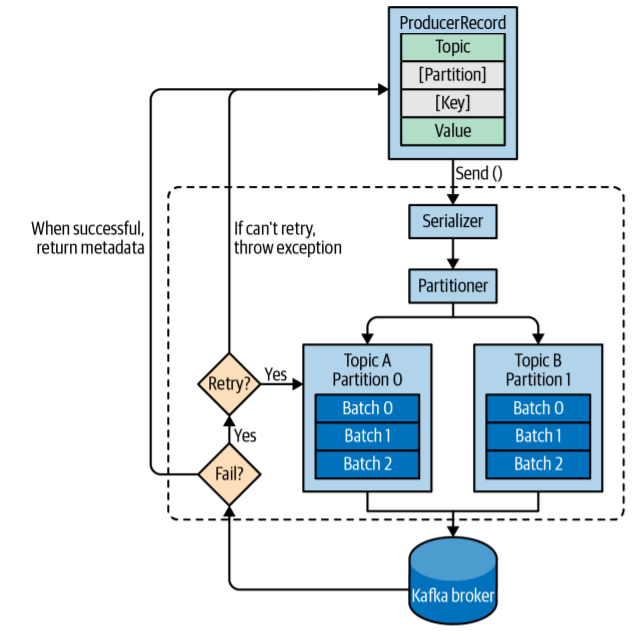

# Apache Kafka

> This is a tutorial course covering Apache Kafka.

Tools used:

- JDK 11
- Maven
- JUnit 5, Mockito
- IntelliJ IDE

## Table of contents

1. [Introduction to Message Brokers and Kafka](https://github.com/backstreetbrogrammer/46_ApacheKafka?tab=readme-ov-file#chapter-01-introduction-to-message-brokers-and-kafka)
    - [Message Brokers - Overview](https://github.com/backstreetbrogrammer/46_ApacheKafka?tab=readme-ov-file#message-brokers---overview)
    - [Kafka - Overview](https://github.com/backstreetbrogrammer/46_ApacheKafka?tab=readme-ov-file#kafka---overview)
    - [Kafka - Key Points](https://github.com/backstreetbrogrammer/46_ApacheKafka?tab=readme-ov-file#kafka---key-points)
2. [Kafka Installation and Cluster setup](https://github.com/backstreetbrogrammer/46_ApacheKafka?tab=readme-ov-file#chapter-02-kafka-installation-and-cluster-setup)
    - [Install WSL2](https://github.com/backstreetbrogrammer/46_ApacheKafka?tab=readme-ov-file#install-wsl2)
    - [Install Java JDK version 11](https://github.com/backstreetbrogrammer/46_ApacheKafka?tab=readme-ov-file#install-java-jdk-version-11)
    - [Install Apache Kafka](https://github.com/backstreetbrogrammer/46_ApacheKafka?tab=readme-ov-file#install-apache-kafka)
    - [Verify Installation](https://github.com/backstreetbrogrammer/46_ApacheKafka?tab=readme-ov-file#verify-installation)
    - [Demo run using command line](https://github.com/backstreetbrogrammer/46_ApacheKafka?tab=readme-ov-file#demo-run-using-command-line)
3. [Kafka Producer](https://github.com/backstreetbrogrammer/46_ApacheKafka?tab=readme-ov-file#chapter-03-kafka-producer)
4. [Kafka Consumer](https://github.com/backstreetbrogrammer/46_ApacheKafka?tab=readme-ov-file#chapter-04-kafka-consumer)

---

## Chapter 01. Introduction to Message Brokers and Kafka

### Message Brokers - Overview

> A message broker (also known as an integration broker or interface engine) is an intermediary computer program module
> that translates a message from the formal messaging protocol of the sender to the formal messaging protocol of the
> receiver.

For example, a message broker may be used to manage a workload queue or message queue for multiple receivers, providing
reliable storage, guaranteed message delivery and perhaps transaction management.

**Key points:**

- Intermediary software (middleware) that passes messages between senders / producers and receivers / consumers
- May provide additional capabilities like:
    - Data Transformation
    - Validation
    - Queuing
    - Routing
- Full decoupling between senders and receivers

The following represent other examples of actions that might be handled by the broker:

- Route messages to one or more destinations
- Transform messages to an alternative representation
- Perform message aggregation, decomposing messages into multiple messages and sending them to their destination,
  then recomposing the responses into one message to return to the user
- Interact with an external repository to augment a message or store it
- Invoke web services to retrieve data
- Respond to events or errors
- Provide content and topic-based message routing using the publish–subscribe pattern

Message brokers are generally based on one of two fundamental architectures:

- **hub-and-spoke**: a central server acts as the mechanism that provides integration services
- **message bus**: the message broker is a communication backbone or distributed service that acts on the bus

Additionally, a more scalable multi-hub approach can be used to integrate multiple brokers.

### Kafka - Overview

> Apache Kafka is a distributed event store and stream-processing platform.


It is an open-source system developed by the Apache Software Foundation written in Java and Scala.

The project aims to provide a unified, high-throughput, low-latency platform for handling real-time data feeds.

Kafka can connect to external systems (for data import/export) via `Kafka Connect`, and provides the `Kafka Streams`
libraries for stream processing applications.

Kafka uses a binary TCP-based protocol optimized for efficiency and relies on a **"message set"** abstraction that
naturally **groups** messages together to reduce the overhead of the network round-trip.

This leads to larger network packets, larger sequential disk operations, contiguous memory blocks which allow Kafka to
turn a stream bursts of random messages writes into linear writes.

Apache Kafka is based on the **commit log**, and it allows users to subscribe to it and publish data to any number of
systems or real-time applications.

A **commit** is the making of a set of tentative changes **permanent**, marking the end of a **transaction** and
providing **Durability** to **ACID** transactions. The **record** of commits is called the **commit log**.


Kafka stores **key-value** messages that come from arbitrarily many processes called **producers**.


The data can be partitioned into different **"partitions"** within different **"topics"**.

Within a **partition**, messages are strictly ordered by their **offsets** (the position of a message within a
partition), and indexed and stored together with a timestamp.



Other processes called **"consumers"** can read messages from partitions.


For **stream processing**, Kafka offers the **Streams API** that allows writing Java applications that consume data from
Kafka and write results back to Kafka.

Kafka runs on a **cluster** of one or more **servers** (called **brokers**), and the partitions of all topics are
distributed across the cluster nodes.

Additionally, partitions are **replicated** to multiple brokers. This architecture allows Kafka to deliver massive
streams of messages in a **fault-tolerant** fashion and has allowed it to replace some of the conventional messaging
systems like Java Message Service (JMS), Advanced Message Queuing Protocol (AMQP), etc.

Kafka offers **transactional writes**, which provide **exactly-once** stream processing using the Streams API.

Kafka supports two types of topics: **Regular** and **compacted**.

**Regular topics** can be configured with a **retention time** or a **space bound**. If there are records that are older
than the specified retention time or if the space bound is exceeded for a partition, Kafka is allowed to **delete** old
data to free storage space.

By default, topics are configured with a retention time of **7 days**, but it's also possible to store data
indefinitely.

For **compacted topics**, records don't expire based on time or space bounds. Instead, Kafka treats later messages as
updates to earlier messages with the same key and guarantees never to delete the latest message per key.

Users can delete messages entirely by writing a so-called **tombstone message** with **null-value** for a specific key.

There are five major APIs in Kafka:

- **Producer API** – Permits an application to publish streams of records.
- **Consumer API** – Permits an application to subscribe to topics and processes streams of records.
- **Connect API** – Executes the reusable producer and consumer APIs that can link the topics to the existing
  applications.
- **Streams API** – This API converts the input streams to output and produces the result.
- **Admin API** – Used to manage Kafka topics, brokers, and other Kafka objects.

The consumer and producer APIs are decoupled from the core functionality of Kafka through an underlying messaging
protocol. This allows writing compatible API layers in any programming language that are as efficient as the Java APIs
bundled with Kafka. The Apache Kafka project maintains a list of such third party APIs.

### Kafka - Key Points

- Apache Kafka is a highly scalable and high performance streaming messaging system
- **Producer Record**: **Key**, **Value** (our message payload), **Metadata** (**Timestamp**/**Topic**/**Partition**)
- **Kafka Topic**: Category of events/messages that consists of **Partitions**
- **Partitions**
    - each partition is an ordered queue
    - each record in a partition has an offset number
    - the **number** of partitions in a topic is directly proportional to the maximum unit of parallelism for a
      Kafka **Topic**
    - we can estimate the right number of partitions for a topic given expected our peak message rate/volume
    - by adding more message **brokers**, we can increase the Kafka topics capacity, transparently to the publishers
    - thus, we can have many broker instances working in parallel to handle incoming messages
    - and, we can have many consumers consuming in parallel from the same topic
- **Single Consumer Group**
    - messages from a topic are load balanced among consumers within a single **consumer group**
    - it's like a **distributed queue**
- Consumers in different **Consumer Groups**
    - messages from a topic are broadcast to all consumer groups
    - it's like a **Publish/Subscribe** system
- **Fault tolerance**
    - each Kafka **topic** is configured with a **replication factor**
    - a replication factor of **N** means each **partition** is replicated to **N** Kafka **brokers**
    - for each **partition**, only one broker acts as a partition **leader**, while other brokers are partition
      **followers**
    - the **leader** takes all the reads and writes
    - the **followers** replicate the partition data to stay in sync with the **leader**
- **Zookeeper**
    - Kafka is using Zookeeper for all its coordination logic
    - Kafka is using Zookeeper as a registry for **brokers** as well as for monitoring and failure detection
      (ephemeral znodes, watchers, etc.)
- **Data Persistence**
    - Kafka persists all its messages to disk
    - Even after messages are consumed by the consumers, the records still stay within Kafka for the configurable
      period of time
    - This allows new consumers to join and consume older messages
    - Consumers that failed in the process of reading/processing a message can retry
    - Failed brokers can recover very fast

---

## Chapter 02. Kafka Installation and Cluster setup

We will cover only the installation on Windows.

### Install WSL2

- Open Powershell in administrative mode
- Type this command: `wsl --install`
- Restart the system
- After restart, `Ubuntu` app will be installed
- Set up Linux username and password
- Disable IPv6 on WSL2

```
sudo sysctl -w net.ipv6.conf.all.disable_ipv6=1
sudo sysctl -w net.ipv6.conf.default.disable_ipv6=1
```

### Install Java JDK version 11

- Run these three commands one by one:

```
wget -O- https://apt.corretto.aws/corretto.key | sudo apt-key add - 
sudo add-apt-repository 'deb https://apt.corretto.aws stable main'
sudo apt-get update; sudo apt-get install -y java-11-amazon-corretto-jdk
```

- Verify by running command: `java -version`

### Install Apache Kafka

- Download the latest Apache Kafka:

```
wget https://downloads.apache.org/kafka/3.6.1/kafka_2.13-3.6.1.tgz
```

- Extract the file:

```
tar -zxvf kafka_2.13-3.6.1.tgz
rm -f kafka_2.13-3.6.1.tgz
```

- Set the PATH variable:

```
vi ~/.bashrc

# append this line at the end and save
PATH="$PATH:/home/risrivas/kafka_2.13-3.6.1/bin" 
```

### Verify Installation

**Start Zookeeper**

- Start Zookeeper by running this command

```
~/kafka_2.13-3.6.1/bin/zookeeper-server-start.sh ~/kafka_2.13-3.6.1/config/zookeeper.properties
```

**Start Kafka**

- Start Kafka by running this command

```
~/kafka_2.13-3.6.1/bin/kafka-server-start.sh ~/kafka_2.13-3.6.1/config/server.properties
```

- **Stop Kafka**: `~/kafka_2.13-3.6.1/bin/kafka-server-stop.sh`
- **Stop Zookeeper**: `~/kafka_2.13-3.6.1/bin/zookeeper-server-stop.sh`

### Demo run using command line

**_Single Producer, Single Consumer, Single Broker and Partition_**

- Start Zookeeper in one terminal:

```
~/kafka_2.13-3.6.1/bin/zookeeper-server-start.sh ~/kafka_2.13-3.6.1/config/zookeeper.properties
```

- Start Kafka in another terminal:

```
~/kafka_2.13-3.6.1/bin/kafka-server-start.sh ~/kafka_2.13-3.6.1/config/server.properties
```

- Create a new topic in the third terminal:

```
~/kafka_2.13-3.6.1/bin/kafka-topics.sh --create --bootstrap-server localhost:9092 --replication-factor 1 --partitions 1 --topic chat
```

List the topic:

```
~/kafka_2.13-3.6.1/bin/kafka-topics.sh --list --bootstrap-server localhost:9092
```

- Start the fourth terminal for producer and publish a few messages:

```
~/kafka_2.13-3.6.1/bin/kafka-console-producer.sh --broker-list localhost:9092 --topic chat
>hello students 1 
>hello students 2 
```

- Start the fifth terminal for consumer and consume messages:

```
~/kafka_2.13-3.6.1/bin/kafka-console-consumer.sh --bootstrap-server localhost:9092 --topic chat --from-beginning
hello students 1 
hello students 2 
```

Publishing a new message in producer prompt will immediately be consumed by the consumer.

Even if we restart the consumer, it will read all the messages in the same **order** as they were published.

**_Running Kafka with multiple brokers and partitions_**

- Create a copy of `~/kafka_2.13-3.6.1/config/server.properties` and name it as `server-1.properties`

```
cd ~/kafka_2.13-3.6.1/config
cp server.properties server-1.properties
```

- Change the following keys in `server-1.properties`:

```
broker.id=1

listeners=PLAINTEXT://:9093

log.dirs=/tmp/kafka-logs-1
```

- Do the same steps as above and create another properties file: `server-2.properties`

- Change the following keys in `server-2.properties`:

```
broker.id=2

listeners=PLAINTEXT://:9094

log.dirs=/tmp/kafka-logs-2
``` 

- Start new Kafka brokers in two more terminals:

```
~/kafka_2.13-3.6.1/bin/kafka-server-start.sh ~/kafka_2.13-3.6.1/config/server-1.properties
```

```
~/kafka_2.13-3.6.1/bin/kafka-server-start.sh ~/kafka_2.13-3.6.1/config/server-2.properties
```

- Create a new topic with three partitions and three replication factors:

```
~/kafka_2.13-3.6.1/bin/kafka-topics.sh --create --bootstrap-server localhost:9092 --replication-factor 3 --partitions 3 --topic purchases
```

List the topics:

```
~/kafka_2.13-3.6.1/bin/kafka-topics.sh --list --bootstrap-server localhost:9092
```

We can also describe a topic:

```
~/kafka_2.13-3.6.1/bin/kafka-topics.sh --describe --bootstrap-server localhost:9092 --topic purchases
```

- Lets produce some messages:

```
~/kafka_2.13-3.6.1/bin/kafka-console-producer.sh --broker-list localhost:9092 --topic purchases
>purchase 1 
>purchase 2 
>purchase 3 
>purchase 4 
```

- Lets consume messages:

```
~/kafka_2.13-3.6.1/bin/kafka-console-consumer.sh --bootstrap-server localhost:9092 --topic purchases --from-beginning
purchase 1 
purchase 2 
purchase 3 
purchase 4 
```

Please note that ordering may **NOT** be guaranteed if the messages are sent to different partitions.

**_Fault tolerance_**

- Let's shut down one of the Kafka brokers, say the one running with `server-1.properties`

This will be shown when we describe the topic

```
~/kafka_2.13-3.6.1/bin/kafka-topics.sh --describe --bootstrap-server localhost:9092 --topic purchases
```

- Lets produce more messages:

```
>purchase 5
>purchase 6
>purchase 7
```

It will all be consumed by consumer.

Restarting consumer will again consume all the messages even if the producer is shut down. No message is lost.

---

## Chapter 03. Kafka Producer

- Start Zookeeper:

```
~/kafka_2.13-3.6.1/bin/zookeeper-server-start.sh ~/kafka_2.13-3.6.1/config/zookeeper.properties
```

- Start three Kafka brokers in three terminals:

```
~/kafka_2.13-3.6.1/bin/kafka-server-start.sh ~/kafka_2.13-3.6.1/config/server.properties
```

```
~/kafka_2.13-3.6.1/bin/kafka-server-start.sh ~/kafka_2.13-3.6.1/config/server-1.properties
```

```
~/kafka_2.13-3.6.1/bin/kafka-server-start.sh ~/kafka_2.13-3.6.1/config/server-2.properties
```

- Create a new topic with three partitions and replication factor of two:

```
~/kafka_2.13-3.6.1/bin/kafka-topics.sh --create --bootstrap-server localhost:9092 --replication-factor 2 --partitions 3 --topic events
```

Describe the topic:

```
~/kafka_2.13-3.6.1/bin/kafka-topics.sh --describe --bootstrap-server localhost:9092 --topic events
```

- Create the Kafka Producer class in IntelliJ

```java
package com.backstreetbrogrammer.producer;

import org.apache.kafka.clients.producer.*;
import org.apache.kafka.common.serialization.LongSerializer;
import org.apache.kafka.common.serialization.StringSerializer;

import java.util.Properties;
import java.util.concurrent.ExecutionException;

public class KafkaProducerDemo {
    private static final String TOPIC = "events";
    private static final String BOOTSTRAP_SERVERS = "localhost:9092,localhost:9093,localhost:9094";

    public static void main(final String[] args) {
        final Producer<Long, String> kafkaProducer = createKafkaProducer(BOOTSTRAP_SERVERS);
        try {
            final int partition = Integer.parseInt(args[0]);
            produceMessages(10, kafkaProducer, partition);
        } catch (final ExecutionException | InterruptedException | NumberFormatException e) {
            System.err.println(e.getMessage());
        } finally {
            kafkaProducer.flush();
            kafkaProducer.close();
        }
    }

    public static void produceMessages(final int numberOfMessages, final Producer<Long, String> kafkaProducer,
                                       final int partition)
            throws ExecutionException, InterruptedException {
        for (int i = 0; i < numberOfMessages; i++) {
            final String value = String.format("event %d", i);
            final long timeStamp = System.currentTimeMillis();
            final ProducerRecord<Long, String> record = new ProducerRecord<>(TOPIC, partition, timeStamp,
                                                                             (long) i, value);
            final RecordMetadata recordMetadata = kafkaProducer.send(record).get();

            System.out.printf("Record with (key: %s, value: %s), was sent to (partition: %d, offset: %d%n",
                              record.key(), record.value(), recordMetadata.partition(), recordMetadata.offset());
        }
    }

    public static Producer<Long, String> createKafkaProducer(final String bootstrapServers) {
        final Properties properties = new Properties();

        properties.put(ProducerConfig.BOOTSTRAP_SERVERS_CONFIG, bootstrapServers);
        properties.put(ProducerConfig.CLIENT_ID_CONFIG, "events-producer");
        properties.put(ProducerConfig.KEY_SERIALIZER_CLASS_CONFIG, LongSerializer.class.getName());
        properties.put(ProducerConfig.VALUE_SERIALIZER_CLASS_CONFIG, StringSerializer.class.getName());

        return new KafkaProducer<>(properties);
    }

}
```

- Build the project using: `mvn clean install`

- Open the WSL Ubuntu app and run the program:

```
cd /mnt/c/Users/~/ApacheKafka

# run with partition = 0 (args[0]) 
java -cp ./target/ApacheKafka-1.0-SNAPSHOT-jar-with-dependencies.jar -Xms128m -Xmx1024m com.backstreetbrogrammer.producer.KafkaProducerDemo 0
```

- Sample output:

```
[kafka-producer-network-thread | events-producer] INFO org.apache.kafka.clients.producer.internals.TransactionManager - [Producer clientId=events-producer] ProducerId set to 2000 with epoch 0
Record with (key: 0, value: event 0), was sent to (partition: 0, offset: 0
Record with (key: 1, value: event 1), was sent to (partition: 0, offset: 1
Record with (key: 2, value: event 2), was sent to (partition: 0, offset: 2
Record with (key: 3, value: event 3), was sent to (partition: 0, offset: 3
Record with (key: 4, value: event 4), was sent to (partition: 0, offset: 4
Record with (key: 5, value: event 5), was sent to (partition: 0, offset: 5
Record with (key: 6, value: event 6), was sent to (partition: 0, offset: 6
Record with (key: 7, value: event 7), was sent to (partition: 0, offset: 7
Record with (key: 8, value: event 8), was sent to (partition: 0, offset: 8
Record with (key: 9, value: event 9), was sent to (partition: 0, offset: 9
```

- Similarly running with `args[0] = 1` for partition 1:

```
java -cp ./target/ApacheKafka-1.0-SNAPSHOT-jar-with-dependencies.jar -Xms128m -Xmx1024m com.backstreetbrogrammer.producer.KafkaProducerDemo 1
```

- Sample output:

```
[kafka-producer-network-thread | events-producer] INFO org.apache.kafka.clients.producer.internals.TransactionManager - [Producer clientId=events-producer] ProducerId set to 3000 with epoch 0
Record with (key: 0, value: event 0), was sent to (partition: 1, offset: 0
Record with (key: 1, value: event 1), was sent to (partition: 1, offset: 1
Record with (key: 2, value: event 2), was sent to (partition: 1, offset: 2
Record with (key: 3, value: event 3), was sent to (partition: 1, offset: 3
Record with (key: 4, value: event 4), was sent to (partition: 1, offset: 4
Record with (key: 5, value: event 5), was sent to (partition: 1, offset: 5
Record with (key: 6, value: event 6), was sent to (partition: 1, offset: 6
Record with (key: 7, value: event 7), was sent to (partition: 1, offset: 7
Record with (key: 8, value: event 8), was sent to (partition: 1, offset: 8
Record with (key: 9, value: event 9), was sent to (partition: 1, offset: 9
```

- If we do not want to choose partition explicitly and let Kafka use hash of the key to determine partitions, we can
  pass `args[0] = -1`:

```
java -cp ./target/ApacheKafka-1.0-SNAPSHOT-jar-with-dependencies.jar -Xms128m -Xmx1024m com.backstreetbrogrammer.producer.KafkaProducerDemo -1
```

- Sample output:

```
[kafka-producer-network-thread | events-producer] INFO org.apache.kafka.clients.producer.internals.TransactionManager - [Producer clientId=events-producer] ProducerId set to 3001 with epoch 0
Record with (key: 0, value: event 0), was sent to (partition: 2, offset: 0
Record with (key: 1, value: event 1), was sent to (partition: 0, offset: 10
Record with (key: 2, value: event 2), was sent to (partition: 0, offset: 11
Record with (key: 3, value: event 3), was sent to (partition: 1, offset: 10
Record with (key: 4, value: event 4), was sent to (partition: 0, offset: 12
Record with (key: 5, value: event 5), was sent to (partition: 1, offset: 11
Record with (key: 6, value: event 6), was sent to (partition: 1, offset: 12
Record with (key: 7, value: event 7), was sent to (partition: 2, offset: 1
Record with (key: 8, value: event 8), was sent to (partition: 1, offset: 13
Record with (key: 9, value: event 9), was sent to (partition: 2, offset: 2
```

NOTE: if we omit the key completely, then Kafka will produce messages to **partitions** in **round-robin** fashion.

---

## Chapter 04. Kafka Consumer

- Create the Kafka Consumer class in IntelliJ

```java
package com.backstreetbrogrammer.consumer;

import org.apache.kafka.clients.consumer.*;
import org.apache.kafka.common.serialization.LongDeserializer;
import org.apache.kafka.common.serialization.StringDeserializer;

import java.time.Duration;
import java.util.Collections;
import java.util.Properties;

public class KafkaConsumerDemo {

    private static final String TOPIC = "events";
    private static final String BOOTSTRAP_SERVERS = "localhost:9092,localhost:9093,localhost:9094";

    public static void main(final String[] args) {
        String consumerGroup = "defaultConsumerGroup";
        if (args.length == 1) {
            consumerGroup = args[0];
        }

        System.out.printf("Consumer is part of consumer group %s%n", consumerGroup);

        final Consumer<Long, String> kafkaConsumer = createKafkaConsumer(BOOTSTRAP_SERVERS, consumerGroup);
        consumeMessages(TOPIC, kafkaConsumer);
    }

    public static void consumeMessages(final String topic, final Consumer<Long, String> kafkaConsumer) {
        kafkaConsumer.subscribe(Collections.singletonList(topic));

        while (true) {
            final ConsumerRecords<Long, String> consumerRecords = kafkaConsumer.poll(Duration.ofSeconds(1));
            if (consumerRecords.isEmpty()) {
                // do something else
            }

            for (final ConsumerRecord<Long, String> record : consumerRecords) {
                System.out.printf("Received record (key: %d, value: %s, partition: %d, offset: %d%n",
                                  record.key(), record.value(), record.partition(), record.offset());
            }

            // do something with the records

            kafkaConsumer.commitAsync();
        }
    }

    public static Consumer<Long, String> createKafkaConsumer(final String bootstrapServers, final String consumerGroup) {
        final Properties properties = new Properties();

        properties.put(ConsumerConfig.BOOTSTRAP_SERVERS_CONFIG, bootstrapServers);
        properties.put(ConsumerConfig.KEY_DESERIALIZER_CLASS_CONFIG, LongDeserializer.class.getName());
        properties.put(ConsumerConfig.VALUE_DESERIALIZER_CLASS_CONFIG, StringDeserializer.class.getName());
        properties.put(ConsumerConfig.GROUP_ID_CONFIG, consumerGroup);
        properties.put(ConsumerConfig.ENABLE_AUTO_COMMIT_CONFIG, false);

        return new KafkaConsumer<>(properties);
    }
}
```

- Build the project using: `mvn clean install`

- Open the WSL Ubuntu app and run the program:

- Produce some messages:

```
cd /mnt/c/Users/~/ApacheKafka

java -cp ./target/ApacheKafka-1.0-SNAPSHOT-jar-with-dependencies.jar -Xms128m -Xmx1024m com.backstreetbrogrammer.producer.KafkaProducerDemo -1
```

- Consume the messages:

```
java -cp ./target/ApacheKafka-1.0-SNAPSHOT-jar-with-dependencies.jar -Xms128m -Xmx1024m com.backstreetbrogrammer.consumer.KafkaConsumerDemo
```

- Sample output:

```
[main] INFO org.apache.kafka.clients.consumer.internals.SubscriptionState - [Consumer clientId=consumer-defaultConsumerGroup-1, groupId=defaultConsumerGroup] Resetting offset for partition events-1 to position FetchPosition{offset=14, offsetEpoch=Optional.empty, currentLeader=LeaderAndEpoch{leader=Optional[DESKTOP-6V79CIU.:9094 (id: 2 rack: null)], epoch=0}}.
Received record (key: 0, value: event 0, partition: 2, offset: 3
Received record (key: 1, value: event 1, partition: 0, offset: 13
Received record (key: 2, value: event 2, partition: 0, offset: 14
Received record (key: 3, value: event 3, partition: 1, offset: 14
Received record (key: 4, value: event 4, partition: 0, offset: 15
Received record (key: 5, value: event 5, partition: 1, offset: 15
Received record (key: 6, value: event 6, partition: 1, offset: 16
Received record (key: 7, value: event 7, partition: 2, offset: 4
Received record (key: 8, value: event 8, partition: 1, offset: 17
Received record (key: 9, value: event 9, partition: 2, offset: 5
```

**_Multiple consumers within the same consumer group_**

- Run three consumers in three terminals for the same consumer group

```
java -cp ./target/ApacheKafka-1.0-SNAPSHOT-jar-with-dependencies.jar -Xms128m -Xmx1024m com.backstreetbrogrammer.consumer.KafkaConsumerDemo
```

- Produce some messages:

```
java -cp ./target/ApacheKafka-1.0-SNAPSHOT-jar-with-dependencies.jar -Xms128m -Xmx1024m com.backstreetbrogrammer.producer.KafkaProducerDemo -1
```

We will observe that each of the three consumers will consume the message based on the partitions on which the
message is published.

**_Publish / Subscribe consumer groups_**

- Run three consumers in three terminals but each for a different consumer group

```
java -cp ./target/ApacheKafka-1.0-SNAPSHOT-jar-with-dependencies.jar -Xms128m -Xmx1024m com.backstreetbrogrammer.consumer.KafkaConsumerDemo group1
```

```
java -cp ./target/ApacheKafka-1.0-SNAPSHOT-jar-with-dependencies.jar -Xms128m -Xmx1024m com.backstreetbrogrammer.consumer.KafkaConsumerDemo group2
```

```
java -cp ./target/ApacheKafka-1.0-SNAPSHOT-jar-with-dependencies.jar -Xms128m -Xmx1024m com.backstreetbrogrammer.consumer.KafkaConsumerDemo group3
```

- Produce some messages:

```
java -cp ./target/ApacheKafka-1.0-SNAPSHOT-jar-with-dependencies.jar -Xms128m -Xmx1024m com.backstreetbrogrammer.producer.KafkaProducerDemo -1
```

We will observe that each of the published messages is broadcast to all the three consumers.

